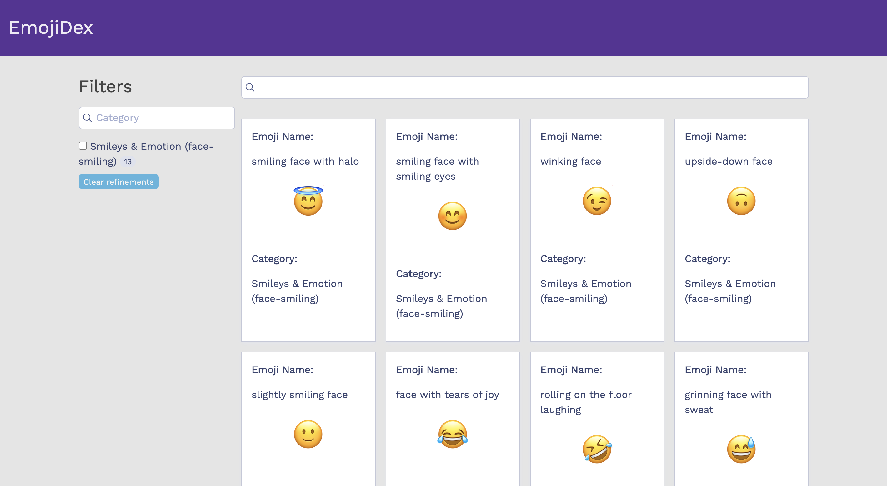

# EmojiDex: An Algolia-Powered Search

## Project Description

EmojiDex is a proof-of-concept for a search engine that is powered by [Algolia](https://www.algolia.com/) and provides an interface to search emojis. Originally inspired by the Pokemon Pokedex, EmojiDex uses Algolia to index a JSON file containing emoji data provided by https://github.com/amio/emoji.json.

This project was was created as part of the mintbean.io Algolia [Hack-To-The-Future](https://www.mintbean.io/mb-event/f45c4fe2-fac3-4fec-9159-a7ec2f2cedf7) 4-hour [hackathon](https://sites.google.com/mintbean.io/2020-06-03-algolia-a-magical-s/home) and was generated with [create-instantsearch-app](https://github.com/algolia/create-instantsearch-app) by [Algolia](https://www.algolia.com/). 

The proof-of-concept can be viewed here: https://connietran-dev.github.io/algolia-emojidex

EmojiDex is featured on mintbean.io's website here: https://www.mintbean.io/project/1e4539e4-1d2e-4d1f-b38c-5ee30156a571 

## Hackathon Takeaways

The hackathon took place over the course of just 4 hours, and I learned a ton in this short time!

**Research Ahead of Time**

While the Algolia documentation is helpful and provides a lot of sample code and sample applications, it would have been helpful to look into the featured technology in advance. Four hours go by fast, especially when you're being exposed to a new technology.

**Brainstorm Ahead of Time** 

After looking into Algolia, it would have been helpful to brainstorm an idea for an application and look into the data needed ahead of time. I spent a significant amount of time thinking of an idea, looking through datasets I could use, and transforming the dataset I did choose so it would work with Algolia's size limitations for datasets. (Also see lesson learned below!)

**The Data You Choose Is Important**

The dataset you choose for Algolia is important. The first emoji dataset I worked with did not have any attributes, properties, or labels. This made it impossible to display any hit results in the UI and also made it hard to display any filters. I had to quickly find a different dataset, index it using Algolia, and adjust my code accordingly.

**Utilizing Node for Client-Side Code**

This was the first front-end only application that I built using Node.js. I've only built applications with a back-end server using Node, so this was a great experience to learn how to utilize Node even in the front-end.

**Being Exposed to New Technology**

The hackathon exposed me to Algolia, which is search-as-a-service. I learned how to index datasets using the Algolia interface and how to use the Algolia framework for quickly developing search functionality. I may not have explored this technology otherwise, and I can definitely see how useful it is.

The Algolia app was also generated using the Algolia InstantSearch command line utility, [create-instantsearch-app](https://github.com/algolia/create-instantsearch-app) by [Algolia](https://www.algolia.com/). This was a super helpful starting place, allowing me time to customize and fit the application to the data from there.

**Times Flies**

A hackathon goes by fast! 4 hours zooms by when you're trying to create a fully functioning application. However, I was still able to utilize the documentation and other resources to the fullest in just a short amount time. 

Even though I'm always wishing for more time to polish any app I build, I was still able to implement and deploy a fully functioning web application and use Algolia search in a really short amount of time! 

After going through this hackathon, I definitely feel more mentally prepared for future hacakthons and look forward to being involved in more events like this.

## Future Enhancements

* Currently, there is only one dataset indexed due to Algolia's size limitations on datasets, thus, there is only one filter. I'd love to index additional datasets. This will create additional filters as well as generate additional pages of emojis.
* The hackathon took place over the course of just 4 hours! Given this short amount of time, I'd love to dive deeper into Algolia's functionality and implement more detailed features that Algolia offers, sin EmojiDexuch as pagination and additional UI components.
* As always, I'd love to continue to make a great user experience and continue to improve the design of the page.

Thank you to mintbean.io for hosting this event. I look forward to many more!